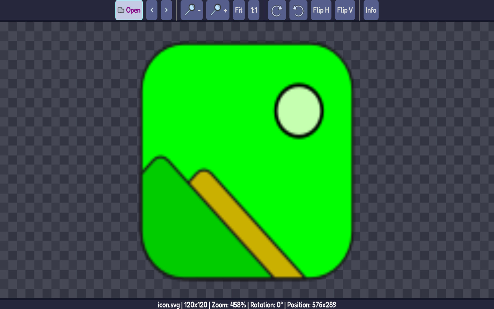
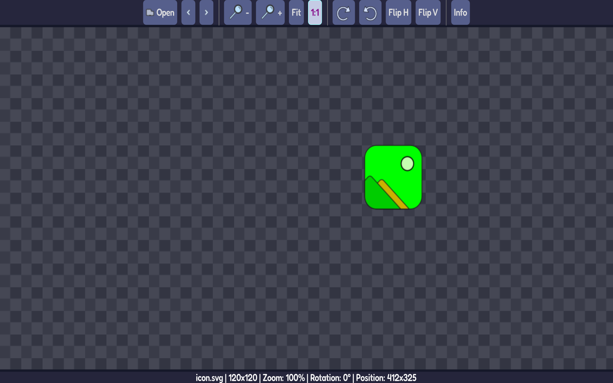
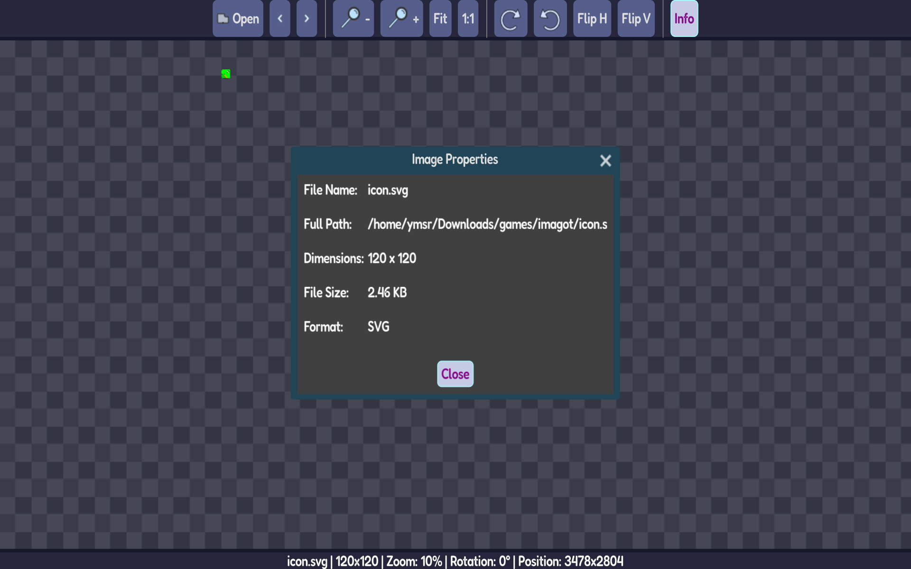

# Imagot

An PoC image viewer in Godot

<div align="center">

[](https://github.com/mlm-games/imagot/releases/latest)
<!--[](https://flathub.org/apps/io.github.mlm_games.imagot)
-->
[](https://aur.archlinux.org/packages/imagot-bin)

<!--[](https://snapcraft.io/imagot)
-->
[](https://community.chocolatey.org/packages/imagot)
[](https://github.com/microsoft/winget-pkgs/tree/master/manifests/m/MLMGames/Imagot)

</div>

## 🖼️ Screenshots

<div align="center">
  
  
  
</div>

## Features

- **Format Support** - PNG, JPG, JPEG, WebP, BMP, TGA, SVG, EXR, HDR
- **Basic Operations** - Zoom, pan, rotate, flip
- **Keyboard Navigation** - Browse images in folder with arrow keys
- **Drag & Drop** - Open images by dragging onto window
- **Lightweight** - Fast startup and minimal resource usage

## Installation

### Windows

```powershell
# WinGet
winget install MLMGames.Imagot

# Chocolatey
choco install imagot

# Scoop
scoop bucket add mlm-games https://github.com/mlm-games/buckets-scoop
scoop install imagot
```

### Linux

```bash
# Flatpak (Flathub)
flatpak install flathub io.github.mlm_games.imagot

# Snap
sudo snap install imagot

# AUR (Arch Linux)
yay -S imagot-bin
```

### macOS & Others

Download from [GitHub Releases](https://github.com/mlm-games/imagot/releases/latest)

## Keyboard Shortcuts

| Action | Shortcut |
|--------|----------|
| Open File | `Ctrl+O` |
| Zoom In/Out | `Ctrl+`/`Ctrl-` |
| Fit to Window | `Ctrl+0` |
| Actual Size | `Ctrl+1` |
| Rotate Left/Right | `Ctrl+L`/`Ctrl+R` |
| Flip Horizontal/Vertical | `H`/`V` |
| Next/Previous Image | `→`/`←` or `D`/`A` |
| Image Properties | `Ctrl+I` |
| Toggle Fullscreen | `F11` |

## Building from Source

Requirements:
- Godot 4.5+
- Git

```bash
# Clone repository
git clone https://github.com/mlm-games/imagot
cd imagot

# Open in Godot Editor
godot project.godot

# Or build from command line
godot --export-release "Linux" builds/imagot
```

## Version Trackers

| Platform   | Version |
|:-----------|:--------|
| F-Droid    |  There are better alts for mobiles |
| Flathub    | [](https://flathub.org/apps/io.github.mlm_games.imagot) |
| Snap Store | [](https://snapcraft.io/imagot) |
| AUR        | [](https://aur.archlinux.org/packages/imagot-bin) |
| WinGet     |  |
| Chocolatey | [](https://community.chocolatey.org/packages/imagot) |
| Scoop      | [](https://github.com/mlm-games/buckets-scoop) |

## License

[GPL-3.0](LICENSE)

---

<div align="center">

Made with Godot Engine

</div>
