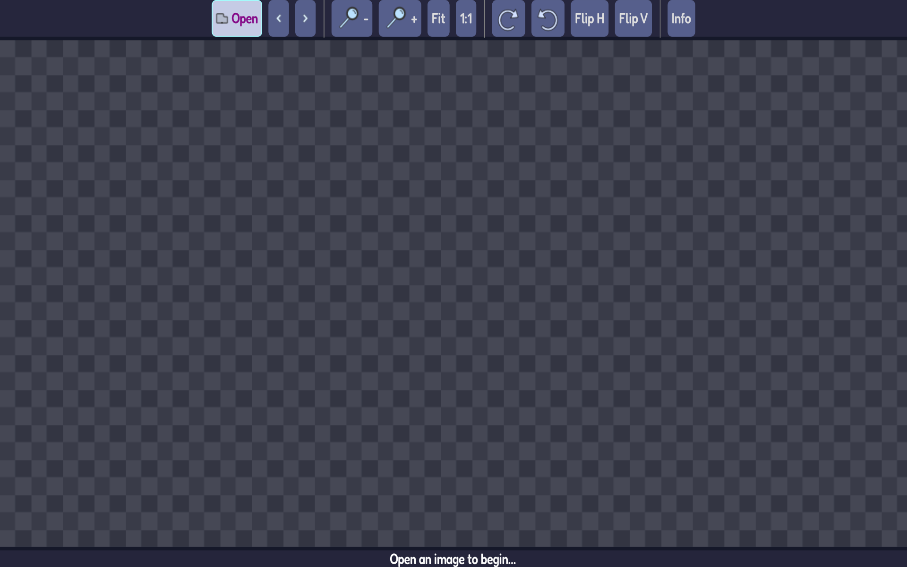

# Imagot

An PoC image viewer in Godot

  
  

  
  
  

  
  
  

<!-- Optional screenshots (uncomment if you keep these paths stable)

  
  
  
  

-->

## Features
- View common formats: PNG, JPG/JPEG, WebP, BMP, TGA, SVG, EXR, HDR
- Zoom, pan, fit, 1:1, rotate, flip
- Keyboard navigation; drag‑and‑drop files
- Lightweight UI (Godot 4.x)

## Install
- Flathub: flatpak install flathub io.github.mlm_games.imagot
- Snap: snap install imagot
- Chocolatey: choco install imagot
- WinGet: winget install MLMGames.Imagot
- AUR: yay -S imagot-bin
- Scoop:
  - scoop bucket add mlm https://github.com/mlm-games/buckets-scoop
  - scoop install imagot
- Direct: GitHub Releases (portable binaries)

## Usage
- Open a file or drag & drop into the window.
- Shortcuts: Ctrl+= / Ctrl+- (zoom), Ctrl+0 (fit), Ctrl+1 (actual size), Ctrl+L / Ctrl+R (rotate), H / V (flip), Left/Right (prev/next).

## License
AGPL‑3.0‑or‑later — see LICENSE.
